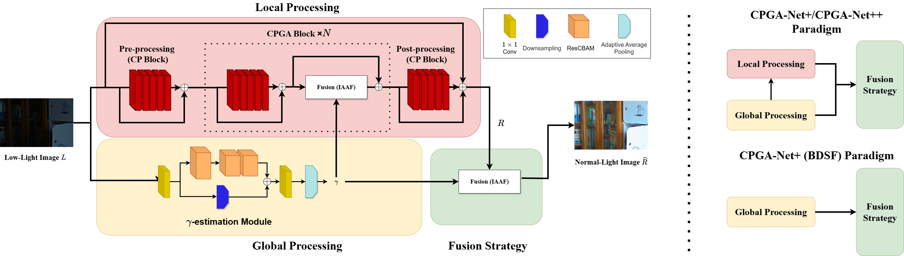

# Rethinking Theoretical Illumination for Efficient Low-Light Image Enhancement

[](https://arxiv.org/abs/2409.05274v4)
[](LICENSE)

Official PyTorch implementation of **CPGA-Net+**, **BDSF**, and **CPGA-Net++**. This project introduces an extended version of the Channel-Prior and Gamma-Estimation Network, incorporating theoretically-based attention for local and global illumination processing.

---

##  Overview

We propose a scalable framework for low-light image enhancement that balances efficiency and performance through three specialized versions:

1.  **CPGA-Net+ (Proposed)**: The standard version combining local and global illumination priors.
2.  **CPGA-Net+ (BDSF)**: An ultra-lightweight variant using **Block Design Simplification (BDSF)**, reducing FLOPs by over 75% for edge device deployment.
3.  **CPGA-Net++ (Stronger)**: A high-performance version utilizing **ConvNeXtBlocks** and **IAAF Masking** to maximize processing capabilities.

### Schematic Diagram


---

##  Preparation

1.  **Clone the project**
2.  **Install dependencies** (Recommended: Python 3.8+):
    ```bash
    pip install -r requirements.txt
    ```

---

##  Usage

### Inference (Demo)
Results will be saved in `runs/demo/`.

| Version | Command Prefix | Required Flags | Pre-trained Weights |
| :--- | :--- | :--- | :--- |
| **CPGA-Net+** | `python demo.py` | `--plus` | [LOLv1](weights/lolv1/enhance_lolv1.pkl) / [v2-R](weights/lolv2-real/enhance_lolv2real.pkl) / [v2-S](weights/lolv2-syn/enhance_lolv2syn.pkl) |
| **BDSF (Efficient)** | `python demo.py` | `--plus --efficient` | Same as CPGA-Net+ |
| **CPGA-Net++** | `python demo.py` | `--plus --iaaf_type IAAF_masking --block_type ConvNeXtBlock` | [LOLv1](weights/CPGANet++_lolv1/CPGANet++_lolv1.pkl) / [v2-R](weights/CPGANet++_lolv2-real/CPGANet++_lolv2-real.pkl) / [v2-S](weights/CPGANet++_lolv2-syn/CPGANet++_lolv2-syn.pkl) |

**Example (CPGA-Net+):**
```bash
python demo.py \
    --net_name "my_test" \
    --val_ori_data_path "path_to_your_img_folder" \
    --val_ll_data_path "path_to_your_img_folder" \
    --plus \
    --ckpt "weights/lolv1/enhance_lolv1.pkl"
```

### Training
Current `train.py` only supports the training of CPGA-Net+. (Not include the ++ version)

```bash
python train.py \
    --epochs 200 \
    --net_name "CPGA-Net+_test" \
    --use_gpu true \
    --gpu 0 \
    --ori_data_path "LOLdataset/Train/high/" \
    --ll_data_path "LOLdataset/Train/low/" \
    --val_ori_data_path "LOLdataset/eval/eval15/high/" \
    --val_ll_data_path "LOLdataset/eval/eval15/low/" \
    --dataset_type "LOL-v1" \
    --num_workers 2 \
    --batch_size 16 \
    --val_batch_size 1 \
    --lr 1e-3 \
    --plus \
    --is_cpgablks \
    --skipSST \
    --crop_size 256
```

> **Note**: 
> - If `skipSST = False` (default), it will start Self-supervised training.
> - If `crop_size = None` (default), it will use the entire resolution for training without cropping.

---

## 📦 Weights
Pre-trained models for the three paired datasets are available. **Efficient (BDSF)** versions share the same weights as their corresponding **CPGA-Net+** counterparts.

| Version | LOLv1 | LOLv2-Real | LOLv2-Syn / Unpaired |
| :--- | :--- | :--- | :--- |
| **CPGA-Net+ / BDSF** | [Link](weights/lolv1/enhance_lolv1.pkl) | [Link](weights/lolv2-real/enhance_lolv2real.pkl) | [Link](weights/lolv2-syn/enhance_lolv2syn.pkl) |
| **CPGA-Net++** | [Link](weights/CPGANet++_lolv1/CPGANet++_lolv1.pkl) | [Link](weights/CPGANet++_lolv2-real/CPGANet++_lolv2-real.pkl) | [Link](weights/CPGANet++_lolv2-syn/CPGANet++_lolv2-syn.pkl) |

---

##  Benchmark Results

### 1. Paired Datasets (LOLv1 / LOLv2) & Efficiency
*Efficiency measured on 600x400 input using NVIDIA RTX 3090.*

| Model | LOLv1 PSNR | LOLv1 SSIM | LOLv1 LPIPS | LOLv2-R PSNR | LOLv2-R SSIM | LOLv2-S PSNR | LOLv2-S SSIM | Params (M) | FLOPs (G) | Inference (ms) |
| :--- | :---: | :---: | :---: | :---: | :---: | :---: | :---: | :---: | :---: | :---: |
| CPGA-Net | 20.94 | 0.748 | 0.260 | 20.79 | 0.759 | 20.68 | 0.833 | 0.025 | 6.030 | 28.256 |
| **CPGA-Net+** | **22.53** | 0.812 | 0.205 | 20.90 | 0.800 | 23.07 | 0.907 | 0.060 | 9.356 | 16.135 |
| **CPGA-Net+ (BDSF)** | **22.53** | 0.812 | 0.205 | 20.90 | 0.800 | 23.07 | 0.907 | **0.020** | **2.141** | **8.318** |
| **CPGA-Net++** | 22.24 | **0.835** | **0.136** | **21.29** | **0.850** | **24.31** | **0.920** | 0.062 | 13.285 | 47.743 |

### 2. Unpaired Datasets (NIQE )
*Lower is better. Measured via Matlab NIQE.*

| Model | MEF | LIME | NPE | VV | DICM | **Avg** |
| :--- | :---: | :---: | :---: | :---: | :---: | :---: |
| CPGA-Net | 3.8698 | 3.7068 | 3.5476 | 2.2641 | 2.6934 | 3.216 |
| **CPGA-Net+** | 3.4968 | 3.0626 | 3.0886 | **1.9133** | 2.8282 | 2.8779 |
| **CPGA-Net+ (BDSF)** | 3.4969 | 3.0655 | 3.0881 | 1.9136 | 2.8268 | 2.8782 |
| **CPGA-Net++** | **3.3825** | **2.8646** | **3.0434** | 1.9302 | **2.5241** | **2.7490** |

---

##  Project Structure
```text
CPGA-Net_Plus/
 config.py         # Hyperparameters & Model flags
 model_cpga.py     # CPGA-Net+ / ++ Architectures
 train.py          # Two-stage Training script
 demo.py           # Inference script
 data.py           # Dataset loaders
 evaluation.py     # PSNR/SSIM/LPIPS Evaluation
 evaluation_niqe.m # Matlab script for NIQE
```

---

##  Citation
```bibtex
@article{weng2024rethinking,
    title={Rethinking Theoretical Illumination for Efficient Low-Light Image Enhancement},
    author={Weng, Shyang-En and Hsiao, Cheng-Yen and Lu, Li-Wei and Huang, Yu-Shen and Chen, Tzu-Han and Miaou, Shaou-Gang and Christanto, Ricky},
    journal={arXiv preprint arXiv:2409.05274v4},
    year={2024},
    url={https://arxiv.org/abs/2409.05274v4}
}

@article{doi:10.1142/S0218001425540138,
    author = {Weng, Shyang-En and Hsiao, Cheng-Yen and Lu, Li-Wei and Huang, Yu-Shen and Chen, Tzu-Han and Miaou, Shaou-Gang and Christanto, Ricky},
    title = {A Lightweight Low-Light Image Enhancement Network via Channel Prior and Gamma Correction},
    journal = {International Journal of Pattern Recognition and Artificial Intelligence},
    volume = {0},
    number = {ja},
    pages = {null},
    year = {2025},
    doi = {10.1142/S0218001425540138}
}
```
