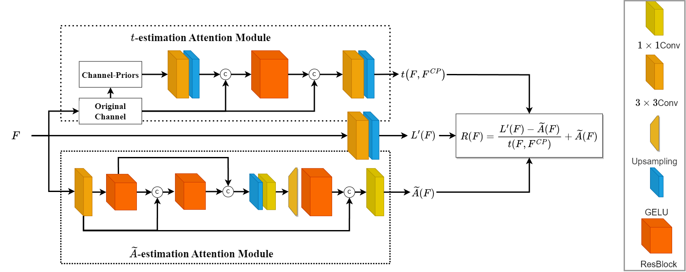

# [Rethinking the Atmospheric Scattering-driven Attention via Channel and Gamma Correction Prior for Low-Light Image Enhancement]()

This is the implementation of CPGA-Net+ based on Pytorch.  

## Abstract
Low-light image enhancement remains a critical challenge in computer vision, and so does the lightweight design for edge devices with the computational burden for deep learning models. In this article, we introduce an extended version of CPGA-Net, termed CPGA-Net+, which incorporates an attention mechanism driven by a reformulated Atmospheric Scattering Model and effectively addresses both global and local image processing through Plug-in Attention with gamma correction. These innovations enable CPGA-Net+ to achieve superior performance on image enhancement tasks, surpassing lightweight state-of-the-art methods with high efficiency. Our results demonstrate the model's effectiveness and show the potential applications in resource-constrained environments.

## Schematic Diagram

## Details


## Preparation
1. clone the project
2. install [Pytorch](https://pytorch.org/)
3. execute the following instruction: 
```
// python=3.8
pip install -r requirements.txt
```
4. make sure these modules have been successfully installed

# Usage
## Data Preparation

Prepare your data, split it into Low-Light images and Normal Light images, both image folder should be paired and the same pair of images should be have the same name. It should be almost the same as original listing way.

## Train

```
python train.py\
    "--epochs" "200"\
    "--net_name" "CPGA-Net+_test"\
    "--use_gpu" "true"\
    "--gpu" "0"

    "--ori_data_path" "LOLdataset/Train/high/"\
    "--ll_data_path" "LOLdataset/Train/low/"\
    "--val_ori_data_path" "LOLdataset/eval/eval15/high/"\
    "--val_ll_data_path" "LOLdataset/eval/eval15/low/"\
    "--dataset_type" "LOL-v1"\

    "--num_workers" "2"\
    "--batch_size" "16"\
    "--val_batch_size" "1"\
    "--lr" "1e-3"\
        
    //If you want to try CPGA-Net+    
    "--plus" "true"\
    "--is_cpgablks" "true"\

    // Training Settings for CPGA-Net+
    //      If skipSST = False (default), it will start Self-supervised training.
    //      If crop_size = None (default), it will use the entire resolution for training without cropping.
    "--skipSST" "true"\
    "--crop_size" "256"\

    // --ckpt "weights\lolv2-syn\enhance_lolv1.pkl"
```
If you want to modify more settings of our network (CPGA-Net+), please check [config.py](./config.py)

## Demo
```
python demo_enhanced.py \
     "--net_name" YOUR_NETNAME"  \

    "--val_ori_data_path" "LOL/TEST/HIGH"  \
    "--val_ll_data_path" "LOL/TEST/LOW"  \
    "--dataset_type" LOL-v1"\
    
    "--num_workers" 1"  \ 
    "--val_batch_size" 1"  \ 

    //If you want to try CPGA-Net+    
    "--plus" "true"\
    "--is_cpgablks" "true"\

    // only for CPGA-Net and not for CPGA-Net+, use DGF
    "--efficient" //DGF version

    // --ckpt "weights\lolv2-syn\enhance_lolv1.pkl"
```

## Evaluation
### LOL evaluation
python3
```
python evaluation.py \
    "--dirA" DIR_A"\
    "--dirB" DIR_B"
```
### LOL evaluation (GT-Mean)
python3
```
evaluation_gtmean.py
```
### 5 sets of unpaired data (NIQE)
Matlab
```
[NIQE] = evaluation_niqe('test_folder_path')
```

## Dataset Selection
### For LOLv2
lolv2 root path need only
```
    "--ori_data_path" "LOLv2_PATH"\
    "--ll_data_path" "LOLv2_PATH"\
    "--val_ori_data_path" "LOLv2_PATH"\
    "--val_ll_data_path" "LOLv2_PATH"\
    
    "--dataset_type" LOL-v2-real"//"LOL-v2-real" or "LOL-v2-Syn"
```
### For Unpaired Data (DEMO: LIME, MEF, DICM, NPE, VV)
```
    "--val_ori_data_path" "Unpaired_PATH"\
    "--val_ll_data_path" "Unpaired_PATH" \
    
    "--dataset_type" LOL-v1",
```
### For your custom images dir (Demo)
```
    "--val_ori_data_path" d:/datasets/custom/testing/INPUT_IMAGES",\
    "--val_ll_data_path" d:/datasets/custom/testing/INPUT_IMAGES",\
    
    "--dataset_type" LOL-v1",
```

## Weights
Three weights according to three paired datasets are provided.
```
// LOLv1
--ckpt "weights\lolv2-syn\enhance_lolv1.pkl"
// LOLv2-real
--ckpt "weights\lolv2-real\enhance_lolv2real.pkl"
// LOLv2-syn & 5 sets of unpaired data
--ckpt "weights\lolv2-syn\enhance_lolv2syn.pkl"
```

# Results
Flops were calculated by [fvcore](https://github.com/facebookresearch/fvcore)
Flops and Inference time (per image) were using a input with 600×400×3 random generated tensor for testing with GPU Nvidia RTX GeForce 3090

## LOLv1(15 pics)
|      | PSNR (dB)| SSIM  | LPIPS |Flops(G) | Params(M) | Inference time|
| ---- | ----  | ----  |  ---- | ----   | ---- | ---- |
|  CPGA-Net   |20.94  | 0.748 | 0.260 | 6.0324 |  0.0254  | 28.256 |
|  CPGA-Net+ (Proposed)   |22.53  | 0.812 | 0.205 |  9.356 | 0.060 | 16.13469|
|  CPGA-Net+ (GT-mean)   |25.1970  | 0.8226 | 0.2012 |  9.356 | 0.060 | 16.13469|


## LOLv2-real(100 pics)
|      | PSNR (dB)| SSIM  | LPIPS |Flops(G) | Params(M) | Inference time|
| ---- | ----  | ----  |  ---- | ----   | ---- | ---- |
|  CPGA-Net   |20.790 |	0.759 | - | 6.0324 |  0.0254  | 28.256 |
|  CPGA-Net+ (Proposed)   |20.90  | 0.800 | 0.261 |  9.356 | 0.060 | 16.13469|
|  CPGA-Net+ (GT-mean)   |26.6108  | 0.8255|  0.2536 |  9.356 | 0.060 | 16.13469|


## LOLv2-syn(100 pics)
|      | PSNR (dB)| SSIM  | LPIPS |Flops(G) | Params(M) | Inference time|
| ---- | ----  | ----  |  ---- | ----   | ---- | ---- |
|  CPGA-Net   |20.790 |	0.759 | - | 6.0324 |  0.0254  | 28.256 |
|  CPGA-Net+ (Proposed)   |23.07 | 0.907 | 0.093 |  9.356 | 0.060 | 16.13469|
|  CPGA-Net+ (GT-mean)   | 26.6792  |  0.9220 | 0.0876 |  9.356 | 0.060 | 16.13469|

## LIME/NPE/MEF/DICM/VV (using NIQE)
Matlab
|      |  MEF | LIME | NPE |VV |DICM | Avg|
| ---- | ---- |---- |---- |---- |---- | ----|
|  CPGA-Net   | 3.8698 |3.7068|	3.5476|	2.2641|	2.6934|	3.216|	
|  CPGA-Net+ (Proposed)   | 3.5002 |3.0662|	3.0826|	1.9133|	2.8266|	2.878|	

# Acknowledge
The idea is based on [A Lightweight Low-Light Image Enhancement Network via Channel Prior and Gamma Correction](https://github.com/Shyandram/CPGA-Net-Pytorch.git)
Lots of code were borrowed from [pytorch version of AOD-Net](https://github.com/walsvid/AOD-Net-PyTorch)  
Evaluation code was borrowed from [HWMNet](https://github.com/FanChiMao/HWMNet.git) and [HVI-CIDNet](https://github.com/Fediory/HVI-CIDNet/blob/master/measure.py)
```
@misc{weng2024lightweight,
      title={A Lightweight Low-Light Image Enhancement Network via Channel Prior and Gamma Correction}, 
      author={Shyang-En Weng and Shaou-Gang Miaou and Ricky Christanto},
      year={2024},
      eprint={2402.18147},
      archivePrefix={arXiv},
      primaryClass={eess.IV}
}
```
